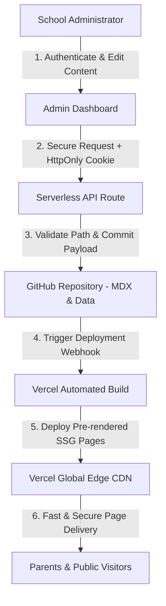

# 🏫 SLB Tunas Harapan Samarinda — Official Website & CMS

> The official website and self-hosted Content Management System (CMS) for **SLB Tunas Harapan Samarinda** (Special Needs School in Samarinda, Indonesia). Built using a modern **JAMstack Architecture**, **Serverless Backend**, and **Git-Based Content Storage** ensuring zero operational cost (Rp 0 / $0 monthly database fees), high performance, and robust cyber security.

---

## 📊 Summary Tech Stack

| Layer / Component | Technology | Description & Role |
| :--- | :--- | :--- |
| **Frontend Framework** | Next.js 16 (App Router) | Static Site Generation (SSG) & React 19 UI |
| **Programming Language** | TypeScript | Strict Type Safety & Reliable Codebase |
| **Styling & Icons** | Tailored CSS / CSS Tokens + Lucide React | Responsive Design & Modern Vector Iconography |
| **Animation** | Framer Motion | Fluid Micro-animations & Interactive UX |
| **Server-side Runtime** | Next.js Serverless Route Handlers | Serverless API Endpoints (No Dedicated Server) |
| **Content Format** | MDX (Markdown + JSX) | Structured Content for School News & Activities |
| **Content Storage** | GitHub Repository API | Version-Controlled Flat Storage (Zero-Cost DB) |
| **Media Processing** | HTML5 Canvas WebP Engine & Next.js Image | Automatic Client-side & Edge Image Compression |
| **Hosting & Edge CDN** | Vercel Global Edge Network | Global Serverless Hosting & Static Content Delivery |
| **CI/CD** | GitHub + Vercel Automated Webhook | Instant Rebuild & Automatic Deployments |
| **Security Controls** | OWASP Top 10 Aligned Controls | Comprehensive Defense Against Cyber Threats |

---

## 🛡️ Cyber Security Evaluation & Remediation (OWASP Aligned)

The system implements strict security controls aligned with the **OWASP (Open Web Application Security Project)** guidelines to protect the application against common siber threats:

### 1. 🔒 Authentication & Secure Session Management (OWASP Task 2)
* **HttpOnly Cookie Sessions**: Session tokens are stored in server-managed **`HttpOnly`**, **`Secure`**, and **`SameSite=Strict`** cookies. JavaScript cannot access session tokens via `document.cookie` or `sessionStorage`, effectively preventing session theft via XSS attacks.
* **Timing-Safe Password Verification**: Password comparison utilizes `crypto.timingSafeEqual` to eliminate timing attack vulnerabilities.
* **Server-side Session Validation**: All administrative endpoints (`/api/admin/*`) verify cryptographic session signatures on the server side.

### 2. 🚫 Strict Rate Limiting & Anti-Brute Force (3 Max Attempts)
* **Admin Login Lockout**: Password attempts are strictly limited to a **maximum of 3 failed attempts**. Exceeding 3 failed attempts triggers an automatic 15-minute IP address lockout.
* **Contact Form Rate Limiting**: The public contact API limits message submissions to **maximum 3 requests per 5 minutes per IP** to prevent automated bot spamming.

### 3. 📁 Server-Side Path Restriction & Scoped Storage (OWASP Task 1)
* **Path Restriction Validation**: Server-side route handlers enforce strict content path validation (`validateAllowedContentPath`). File write and delete operations are restricted strictly to `/content/kegiatan/`, `/public/images/kegiatan/`, `/content/data/galeri.ts`, and `/public/images/galeri/`. Attempts to write to application source code (e.g., `/app`, `/components`, `/lib`) are rejected with `403 Forbidden`.
* **Fine-Grained GitHub PAT Security**: Configured to work with GitHub Fine-Grained Personal Access Tokens restricted strictly to the target repository.

### 4. 🧹 Input Sanitization & MDX Code Escaping (OWASP Task 4)
* **Anti-XSS Input Cleansing**: All inputs from public and admin forms pass through `sanitizeInputString()` to strip malicious HTML and script tags.
* **MDX Expression Escaping**: MDX content generation escapes potentially dangerous JSX expressions (`{`, `}`, `<`, `>`) via `escapeMdxContent()` to prevent remote code execution during Vercel static build compilation.
* **Path Traversal Shield**: Slugs and file parameters are sanitized with `sanitizeSlug()` to prevent `../` directory traversal attacks.

### 5. 🌐 Infrastructure & HTTP Security Headers (OWASP Task 5)
* **`Strict-Transport-Security` (HSTS)**: Forces encrypted HTTPS connections (`max-age=63072000; includeSubDomains; preload`).
* **`X-Frame-Options: DENY`**: Prevents Clickjacking attacks.
* **`X-Content-Type-Options: nosniff`**: Mitigates MIME-sniffing exploits.
* **`Referrer-Policy` & `Permissions-Policy`**: Controls referrer privacy and disables unnecessary browser APIs (camera/microphone/geolocation).

---

## 🎯 Architecture Rationale (Why This Architecture?)

1. **Zero-Cost Operation ($0 / Month)**: Eliminates monthly expenses for dedicated VPS servers or SQL databases.
2. **Static-First Performance (SSG)**: Pre-rendered static pages hosted on Vercel's Global Edge CDN ensure ultra-fast load times for parents on mobile connections.
3. **Git-Based Storage Efficiency**: For structured school profiles, activity articles, and photo galleries, Git storage provides built-in version control, audit history, and zero maintenance overhead.
4. **Natural Resilience**: Serving static pages means there is no database server to crash or exploit via SQL injection.

---

## 🏗️ System Architecture Flow



---

## ⚡ Performance Optimization

* **Static Site Generation (SSG)**: Pages are pre-rendered at build time for near-instant page loads.
* **Dual-Layer Image Compression**: 
  - *Client-Side*: Images uploaded by admins are automatically resized and converted to **WebP (~100-200 KB)** in browser memory before network transmission.
  - *Edge Optimizer*: Vercel Image Engine delivers AVIF/WebP formats tailored to visitor device screens.
* **Font Optimization**: Google Poppins font loaded via `next/font/google` with `display: swap` to prevent Cumulative Layout Shifts (CLS).
* **SEO & Structured Data**: Built-in Schema.org JSON-LD structured data (`School` / `EducationalOrganization`) and Google Search Console metadata.

---

## 📈 Scalability & Future Roadmap

* **Edge CDN Scalability**: Capable of handling thousands of daily visitors with zero server degradation.
* **Seamless Migration Path**: Easily extensible to relational databases (e.g., Supabase / PostgreSQL) or full Headless CMS if advanced multi-role needs arise.

### 🔮 Future Roadmap
- [ ] **Public Search**: Integrated search bar for activities and news.
- [ ] **Drafting & Scheduled Publishing**: Save drafts and schedule automated post releases.
- [ ] **Analytics Dashboard**: Integrated privacy-friendly visitor analytics.
- [ ] **Multi-User Editor Roles**: Granular RBAC (Editor vs. Super Admin).

---

## 💻 Local Development Setup

```bash
# 1. Clone repository
git clone https://github.com/mustafidh08/Web-SLB-Tunas-Harapan-Samarinda.git

# 2. Enter project directory
cd slb-tunas-harapan

# 3. Install dependencies
npm install

# 4. Start local development server
npm run dev
```

Open [http://localhost:3000](http://localhost:3000) in your browser to view the site.

---

*Empowering SLB Tunas Harapan Samarinda — Delivering Inclusive, Fast, and Secure Special Needs Education Information.*
