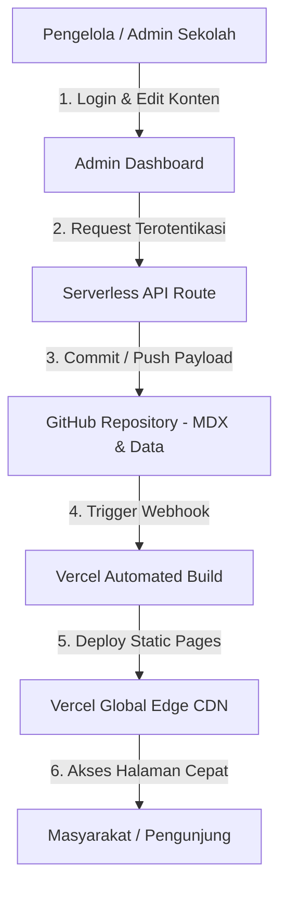

# 🏫 Website Profil & CMS SLB Tunas Harapan Samarinda

> Website resmi dan Sistem Manajemen Konten (CMS) mandiri untuk SLB Tunas Harapan Samarinda. Dirancang dengan arsitektur **JAMstack Modern**, **Serverless Backend**, dan **Git-Based Storage** yang cepat, aman, dan berbiaya operasional Rp 0,- (Zero-Cost).

---

## 📊 Summary Tech Stack

| Layer / Komponen | Teknologi | Keterangan & Peran |
| :--- | :--- | :--- |
| **Frontend Framework** | Next.js 16 (App Router) | Static Site Generation (SSG) & UI Rendering |
| **Language** | TypeScript | Type Safety & Pengkodean yang Andal |
| **Styling & Icons** | Vanilla CSS / Tailored Tokens + Lucide React | Desain Responsif & Ikonografi Modern |
| **Animation** | Framer Motion | Transisi Micro-animation Halus |
| **Server-side Runtime** | Next.js Serverless Route Handlers | API Endpoint Tanpa Server Fisik |
| **Content Format** | MDX (Markdown + JSX) | Format Berita & Artikel Kegiatan |
| **Content Storage** | GitHub Repository | Version-controlled Flat Storage (Zero-Cost) |
| **Media Processing** | Canvas WebP API & Next.js Image Engine | Kompresi & Format Gambar Otomatis |
| **Hosting & Edge CDN** | Vercel Global Edge Network | Deployment & Distribusi Serverless |
| **CI/CD** | GitHub + Vercel Webhook | Rebuild & Deployment Otomatis |
| **Security Controls** | OWASP Best Practices | Protection Against Common Cyber Threats |

---

## 🎯 Mengapa Arsitektur Ini Dipilih? (Why This Architecture)

Pemilihan arsitektur **JAMstack + Serverless + Git-Based Storage** didasarkan pada analisis kebutuhan nyata sekolah:

1. **Zero-Cost Hosting & Database**: Sekolah tidak perlu membayar biaya sewa server VPS atau database SQL bulanan.
2. **Static-First Performance (SSG)**: Seluruh halaman publik disajikan sebagai HTML statis dari Vercel Edge CDN, membuat waktu muat (*load time*) sangat cepat bagi wali murid di berbagai jaringan internet.
3. **Ramah SEO**: Pre-rendered HTML + Structured Data (Schema.org) memudahkan mesin pencari Google melakukan pencatatan (*indexing*).
4. **Bebas Maintenance Server Database**: Tidak perlu melakukan patching database, backup dump bulanan, atau mengelola koneksi database pool.
5. **Skalabilitas Tinggi**: Mampu menangani lonjakan pengunjung harian tanpa perlu melakukan upgrade server.

---

## 📁 Mengapa Memilih Git-Based Content Storage?

Konten website sekolah (profil, berita kegiatan, dan galeri foto) bersifat terukur dan memiliki frekuensi pembaruan berkala (bukan juta-an transaksi per detik). Oleh karena itu, penyimpanan berbasis Git adalah pilihan yang sangat efisien:

> *"Penyimpanan berbasis Git membuat pengelolaan konten lebih sederhana, hemat biaya, memiliki riwayat perubahan (version control) bawaan, dan sangat mudah dipelihara tanpa overhead infrastruktur database SQL."*

---

## 🏗️ Diagram Arsitektur Sistem



---

## 🛡️ Kontrol Keamanan Siber (Security Controls)

Website ini menerapkan kontrol keamanan yang mengacu pada praktik terbaik **OWASP (Open Web Application Security Project)** untuk mengurangi risiko serangan siber umum:

### 1. Autentikasi & Otorisasi
* **Timing-Safe Password Comparison**: Menggunakan `crypto.timingSafeEqual` pada proses verifikasi password admin untuk mencegah *Timing Attacks*.
* **Protected Routes**: Seluruh endpoint API pengelola (`/api/admin/*`) dilindungi oleh otentikasi server-side.
* **Session Management**: Pengelolaan sesi admin terisolasi dengan penanganan batas waktu sesi (*session timeout*).

### 2. Secure Coding Practices
* **Input Sanitization (Anti-XSS)**: Seluruh formulir (berita, galeri, dan kontak publik) menggunakan fungsi sanitasi untuk membuang skrip atau tag HTML berbahaya.
* **Path Traversal Protection**: Pembersihan `slug` dan nama berkas melalui `sanitizeSlug` untuk mencegah manipulasi penulisan berkas (`../../`).
* **Vektor Serangan SQL**: Bebas dari risiko *SQL Injection* karena arsitektur ini tidak menggunakan server database SQL.

### 3. Keamanan Infrastruktur (HTTP Security Headers)
* **`Strict-Transport-Security` (HSTS)**: Memaksa enkripsi HTTPS pada seluruh komunikasi browser.
* **`X-Frame-Options: DENY`**: Mencegah serangan *Clickjacking*.
* **`X-Content-Type-Options: nosniff`**: Mencegah pemindaian tipe media (*MIME sniffing*).
* **`Referrer-Policy` & `Permissions-Policy`**: Mengontrol privasi referrer dan membatasi akses ke perangkat periferal (kamera/mikrofon).

### 4. Rate Limiting & Anti-Brute-Force
* **Admin Login**: Maksimal 5 kali percobaan salah. Jika terlampaui, IP akan diblokir sementara selama 15 menit.
* **Form Kontak Publik**: Maksimal 3 kali pengiriman per 5 menit per IP untuk mencegah *bot spamming*.

---

## ⚡ Optimalisasi Performa (Performance Optimization)

* **Static Site Generation (SSG)**: Halaman di-render secara penuh saat proses *build*, sehingga server tidak perlu melakukan pemrosesan ulang saat pengunjung membuka halaman.
* **Client-Side & Server-Side Image Optimization**: Foto dari HP/kamera otomatis dikompres dan dikonversi ke format **WebP / AVIF** di browser admin sebelum diunggah, serta disajikan secara optimal oleh Vercel Image Engine.
* **Font Optimization**: Penggunaan `next/font/google` dengan strategi `display: swap` untuk mencegah keterlambatan rendering teks (*layout shift*).
* **Lazy Loading & Code Splitting**: Komponen dan berkas JavaScript dimuat secara bertahap sesuai kebutuhan halaman.

---

## 📈 Skalabilitas & Jalur Pengembangan Masa Depan

* **Kemampuan Skalabilitas**: Karena disajikan via Edge CDN, website sanggup melayani ribuan pengunjung harian tanpa penurunan kecepatan.
* **Jalur Migrasi Fleksibel**: Jika kebutuhan sekolah berkembang pesat di masa mendatang (misal membutuhkan portal nilai siswa atau fitur multi-user kompleks), arsitektur ini mudah ditransisikan ke database relasional (seperti Supabase / PostgreSQL) atau Headless CMS penuh.

### 🔮 Future Roadmap
- [ ] **Pencarian Publik**: Fitur pencarian berita kegiatan terintegrasi.
- [ ] **Drafting & Scheduled Publishing**: Fitur simpan draf dan publikasi terjadwal.
- [ ] **Analytics Dashboard**: Integrasi Vercel Analytics untuk statistik pengunjung.
- [ ] **Multi-User Editor Role**: Pembagian peran pengelola (Editor & Super Admin).

---

## 💻 Cara Menjalankan Proyek Secara Lokal

```bash
# 1. Clone repositori
git clone https://github.com/mustafidh08/Web-SLB-Tunas-Harapan-Samarinda.git

# 2. Masuk ke direktori proyek
cd slb-tunas-harapan

# 3. Install dependensi
npm install

# 4. Jalankan server pengembangan
npm run dev
```

Buka [http://localhost:3000](http://localhost:3000) di browser Anda.

---

*Dikembangkan untuk SLB Tunas Harapan Samarinda — Mewujudkan Akses Informasi Inklusif, Modern, dan Andal.*
